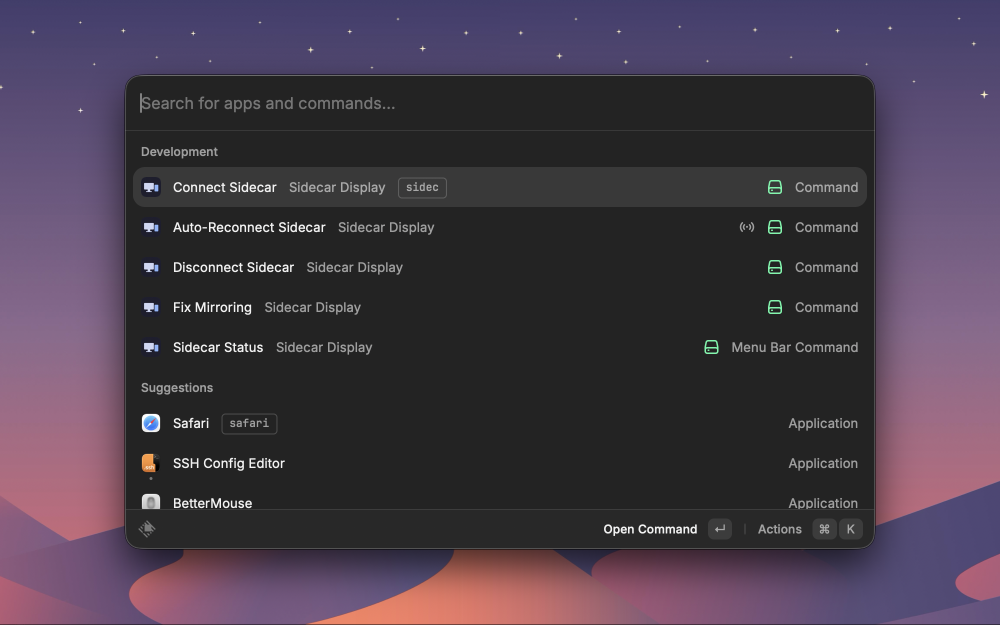
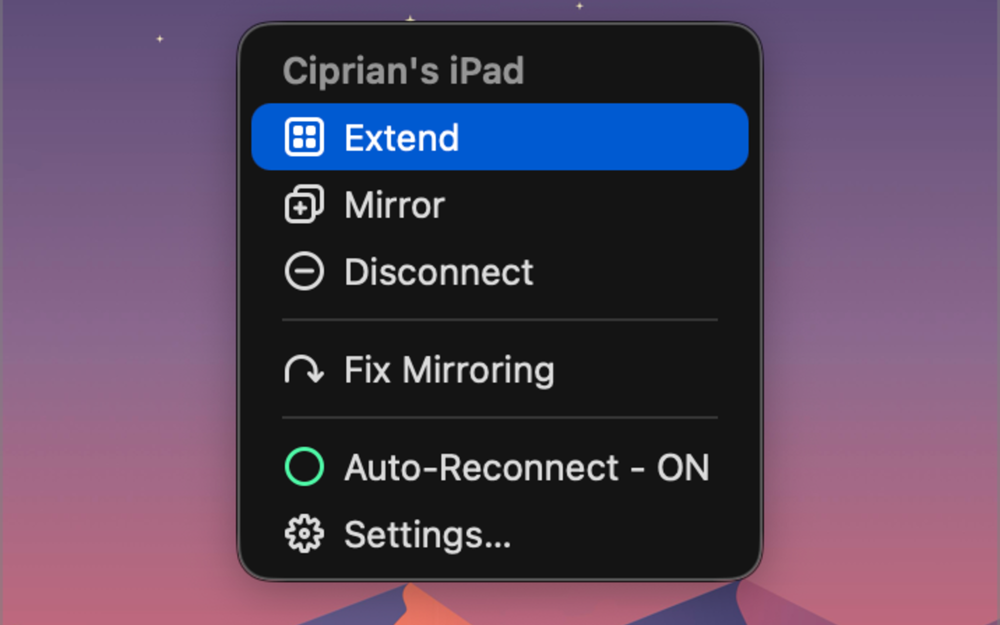
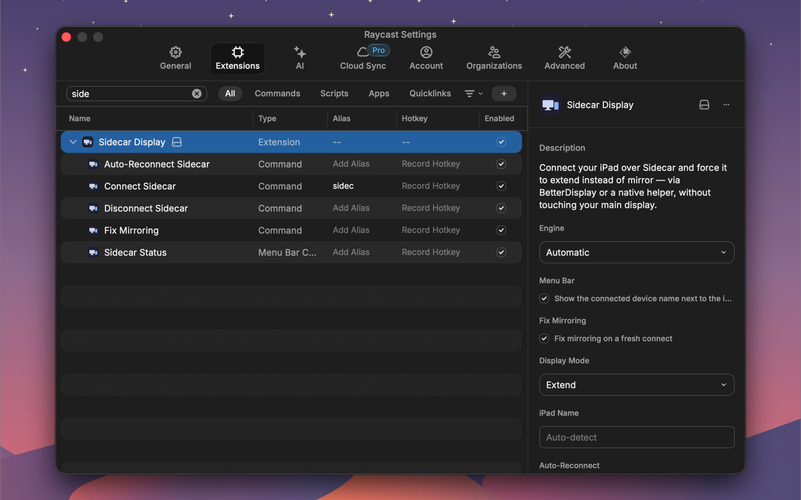

# Sidecar Display

[](https://github.com/chiptoma/sidecar-display/actions/workflows/ci.yml)
[](./LICENSE)


A [Raycast](https://raycast.com) extension that connects your iPad over **Sidecar** and forces it to **extend** rather than mirror — reliably, from a hotkey or the menu bar, without ever moving or touching your main display.



It ships **two interchangeable engines** and picks the right one automatically:

- **BetterDisplay** — drives the `betterdisplaycli` binary. Proven and low-maintenance; needs the [BetterDisplay](https://github.com/waydabber/BetterDisplay) app.
- **Native** — a small Swift helper using the private `SidecarCore` framework plus public CoreGraphics. No external dependency at runtime.

No AppleScript, no System Settings window, no UI-tree scraping.

---

## Contents

- [Why this exists](#why-this-exists)
- [Install](#install)
- [Commands](#commands)
- [Preferences](#preferences)
- [How it works](#how-it-works)
- [Development](#development)
- [Publishing](#publishing)
- [Limitations](#limitations)
- [Documentation](#documentation)
- [License](#license)

---

## Why this exists

The usual way to attach an iPad is to click it under **Mirror or extend to** in System Settings → Displays. On a Mac that already uses a BetterDisplay **virtual screen as its main display** (a common multi-monitor setup), macOS often resolves that menu to *mirroring* — so the iPad comes up showing a copy of your desktop, and you have to hand-run BetterDisplay's "Reconnect virtual displays" to get an extended desktop back.

This extension attaches Sidecar **programmatically**, which extends by default — and when macOS still comes up mirrored, it repairs it with one deliberate action, without ever writing or relocating your main display.

## Install

### From the Raycast Store

Not yet published to the Raycast Store. Install from source below.

### From source (local)

```sh
git clone https://github.com/chiptoma/sidecar-display.git
cd sidecar-display
npm install
npm run dev
```

`npm run dev` imports the extension into Raycast and hot-reloads it. Stopping it leaves the extension installed. `npm run build` type-checks and compiles without importing.

**Requirements**

- macOS with Sidecar support, and an iPad signed in to the same Apple ID.
- Raycast.
- For the **BetterDisplay** engine: [BetterDisplay](https://github.com/waydabber/BetterDisplay) running with CLI integration enabled (on by default) — `brew install --cask betterdisplay`. Tested against **BetterDisplay 4.3.5** with Pro; non-Pro is unverified.
- To **build from source** (either engine): a full **Xcode** install — the native engine's Swift is compiled at build time by Raycast's [`extensions-swift-tools`](https://github.com/raycast/extensions-swift-tools). (Store *users* don't need Xcode; they install the already-compiled extension.)

## Commands

| Command | Behaviour |
| --- | --- |
| **Connect Sidecar** | Attaches the iPad, waits for its display, applies the configured mode (extend by default). Idempotent. |
| **Disconnect Sidecar** | Detaches the iPad. Idempotent. |
| **Auto-Reconnect Sidecar** | Background command that restores a dropped link. Run it by hand to reconnect now. See [keep-alive](./docs/ARCHITECTURE.md#auto-reconnect-keep-alive). |
| **Fix Mirroring** | Clears macOS Sidecar's own mirror mode when the iPad connects showing a copy of your main screen. Needs BetterDisplay. |
| **Sidecar Status** | Menu-bar item: device name, connection state, connect / disconnect / extend / mirror actions, an Auto-Reconnect toggle, plus a device picker. |

Bind Connect and Disconnect to hotkeys in Raycast, or drive everything from the menu bar:



## Preferences



| Preference | Default | Purpose |
| --- | --- | --- |
| Engine | `Automatic` | BetterDisplay if its CLI is installed, otherwise Native. Or pin one explicitly. |
| Menu Bar | off | *Show the connected device name next to the icon.* Off keeps a constant-width icon (friendlier to Bartender/Ice). |
| Fix Mirroring | **on** | *Fix mirroring on a fresh connect.* Reconnects the main virtual screen automatically when the iPad newly attaches, to clear Sidecar's mirror mode. Briefly reshuffles the desktop. Requires BetterDisplay; ignored without it. |
| Display Mode | `Extend` | Where the iPad should end up: extending, or folded into the main display's mirror set. |
| iPad Name | *(empty)* | Leave empty to auto-detect. Set it only to pin one when you have more than one Sidecar device. |
| Auto-Reconnect | **on** | *Default* for reconnecting the iPad automatically after it drops. The menu-bar **Auto-Reconnect** toggle overrides this once used. Off stops all automatic reconnects; you can still reconnect by hand. Also needs Background Refresh enabled on the command. |
| Fast Reconnect Attempts | `3` | Quick reconnect attempts after a drop before slowing to the heartbeat. |
| Backoff Base (seconds) | `15` | Initial wait between fast attempts; doubles each try up to the cap. |
| Backoff Cap (seconds) | `60` | Longest wait the doubling backoff reaches. Clamped to at least the base. |
| Slow Retry (seconds) | `300` | How often to retry once the fast attempts are spent and the iPad is still absent. |
| Wake Threshold (seconds) | `120` | A gap this long between background ticks counts as a wake, so the next tick reconnects immediately. |
| BetterDisplay CLI | `/opt/homebrew/bin/betterdisplaycli` | Path to the binary (Intel Homebrew: `/usr/local/bin/...`). |
| Settle Timeout | `6` | Seconds to wait for a display change to take effect. Clamped to 2–60. |

Every auto-reconnect timing knob is configurable. Note that Raycast runs background commands only about **once a minute**, so backoff values under ~60 s effectively mean "every tick" — the sub-minute knobs mostly shape the tail of the fast phase.

## How it works

macOS Sidecar has its own "Mirror / Use as Separate Display" mode that is **invisible to every display API** — CoreGraphics, `NSScreen`, and BetterDisplay all report the iPad as extended even while it is showing a copy of your screen. So the extension **cannot detect** the mirrored state. Instead it **extends by default** by attaching Sidecar programmatically, and when macOS still comes up mirrored it repairs it with one deliberate action ([Fix Mirroring](#commands)).

Every window-affecting change is **converge-and-hold**: the mode is re-asserted until it reads correct several times running, because macOS spends about a second rearranging a fresh Sidecar display — often mirrored first, then extended.

**Safety — the main display is sacred.** The extension never writes or relocates your main display, and the connect/mode path never disconnects or power-cycles any display. Mirroring always keeps your current main as master (never the iPad), and both mode writes are refused when the iPad is itself main. The one place a display is ever cycled is the explicit, opt-in Fix Mirroring — virtual screens only, never physical, always reconnected. This isn't theoretical: an earlier "mitigation" once scrambled every window and caused a logout, and was removed entirely.

**→ Full architecture, safety invariants, design decisions, and project layout: [docs/ARCHITECTURE.md](./docs/ARCHITECTURE.md).**

## Development

```sh
npm install
npm run dev          # import into Raycast + hot-reload
npm run lint         # ESLint + Prettier
npm run build        # compile + generate types + typecheck (no import)
npm run test:unit    # hardware-free tests — run before every commit
```

Building needs a full **Xcode** install: the native engine's Swift is a standard SPM package in `swift/` that `ray build`/`ray develop` compile for you (generating the `swift:../../swift` bridge). You never run `swiftc`, and no binary is committed. The pure decision logic — the keep-alive state machine and the connect orchestration — is unit-tested headlessly against mocks, so the safety invariants are proven without any hardware.

**→ Full runbook (setup, testing matrix, CI, releasing, publishing, troubleshooting): [docs/WORKFLOWS.md](./docs/WORKFLOWS.md).** Conventions (banners, naming, TypeScript/Swift rules, commits) live in [CONTRIBUTING.md](./CONTRIBUTING.md).

## Publishing

Public Raycast Store extensions are submitted as a **pull request to [`raycast/extensions`](https://github.com/raycast/extensions)** and reviewed by a human — there is no headless/CI publish, and all Store extensions are free and open-source (MIT).

```sh
npm run publish      # build + typecheck + tests, then opens the store PR
```

Pushing a `v*` git tag cuts a GitHub Release automatically. Full checklist: [docs/WORKFLOWS.md](./docs/WORKFLOWS.md#6-publishing-to-the-raycast-store).

## Limitations

- Auto-reconnect is interval-polled, not event-driven — macOS exposes no on-wake or display-change event to extensions. Reconnection lands within about one interval of a drop.
- Connecting the iPad from Control Center or the AirPlay menu (rather than through this extension) will not run the extend/mirror logic, and auto-reconnect will not treat that as an intent to keep alive.
- macOS itself decides which display is main when Sidecar attaches, and can put main on the iPad. The extension reports that and leaves the arrangement to you — it never writes the main display.
- If the display mode won't settle, the extension reports it rather than forcing it. Fix a stuck arrangement by hand in BetterDisplay or Displays settings.
- The menu bar and background commands are macOS-only.
- Sidecar's own mirror mode is invisible to every display API, so the mirror fix is a manual/opt-in action, not an automatic "detect and repair."

## Documentation

| Resource | What's inside |
| --- | --- |
| [docs/ARCHITECTURE.md](./docs/ARCHITECTURE.md) | How it works, safety invariants, design decisions, project structure |
| [docs/WORKFLOWS.md](./docs/WORKFLOWS.md) | Setup, dev loop, testing matrix, CI, releasing, publishing, troubleshooting |
| [CONTRIBUTING.md](./CONTRIBUTING.md) | Conventions: banners, naming, TypeScript/Swift rules, commits |
| [CHANGELOG.md](./CHANGELOG.md) · [SECURITY.md](./SECURITY.md) | Release notes · security policy |

## License

[MIT](./LICENSE)
